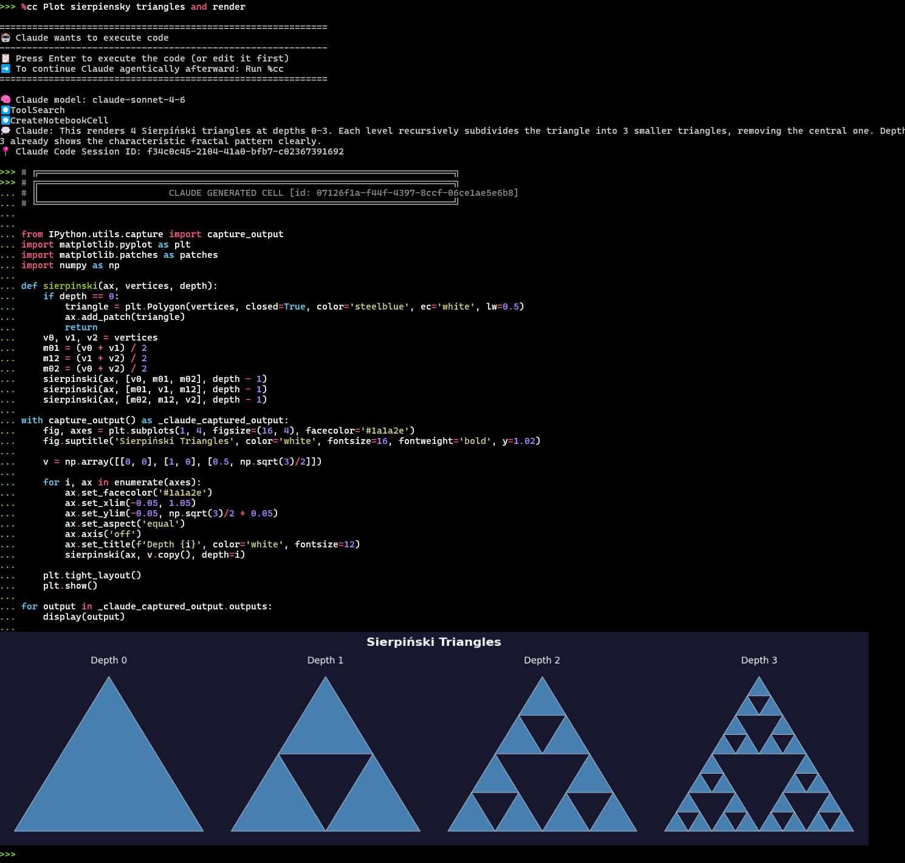

# cc_jupyter

Claude Code magic for IPython / Jupyter notebooks.

## Install

```bash
pip install git+https://github.com/rolveb/cc_jupyter.git
```

## Enable

```python
%load_ext cc_jupyter
```

Autoload on every IPython start — add to `~/.ipython/profile_default/startup/00-cc.py`:

```python
try:
    get_ipython().run_line_magic("load_ext", "cc_jupyter")
except Exception:
    pass
```

## Usage

```python
%cc Plot Sierpiński triangles and render
```


```python
%cc_new  # fresh conversation
%cc --model opus <prompt>
%cc --import data.py <prompt>
```

Matplotlib works out of the box — sixel output in terminals with `img2sixel`:


